= Bitbucket Branch Source Plugin

[id=bitbucket-sect-intro]

_Bitbucket Branch Source plugin_ allows use of Bitbucket Cloud and Data Center as a multi-branch project source in two different ways:

 * *Single repository source*: automatic creation of jobs for branches and pull requests in a specific repository.
 * *Organization folders*: automatic creation of multi-branch projects for each visible repository in a specific Bitbucket Team or Project.

IMPORTANT: Since version 937.0.0 this plugin officially supports *only* versions of Bitbucket Data Center *not* excluded by the link:https://confluence.atlassian.com/support/atlassian-end-of-support-policy-201851003.html[End Of Support (EOS)] policy.

[id=bitbucket-scm-source]
== Branches and pull requests auto-discovering

This plugin adds an additional item in the "Branch Sources" list of multi-branch projects.
Once configured, branches and pull requests are automatically created and built as branches in the multi-branch project.

Follow these steps to create a multi-branch project with Bitbucket as a source:

. If using Bitbucket Data Center, the server base URL needs to be added to the Bitbucket Endpoints first in the "Manage Jenkins" > "System" configuration.
. Create the multi-branch project. This step depends on which multi-branch plugin is installed.
For example, "Multibranch Pipeline" should be available as a project type if Pipeline Multibranch plugin is installed.
+
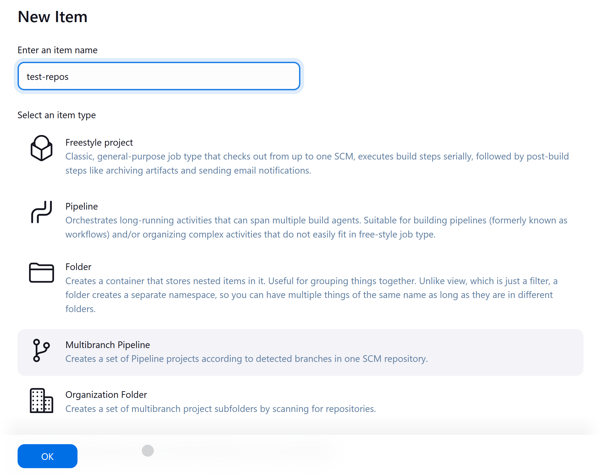

. Select "Bitbucket" as _Branch Source_
+
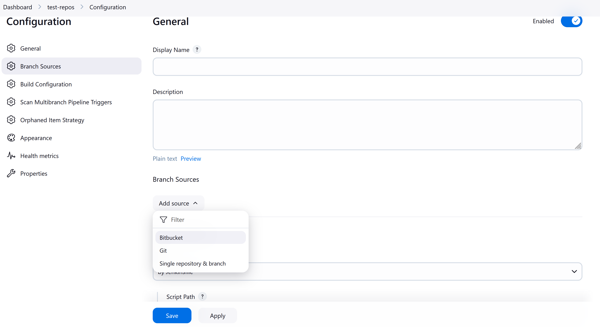

. Set credentials to access Bitbucket API and checkout sources (see "Credentials configuration" section below).
. Set the repository owner and name that will be monitored for branches and pull requests.
+
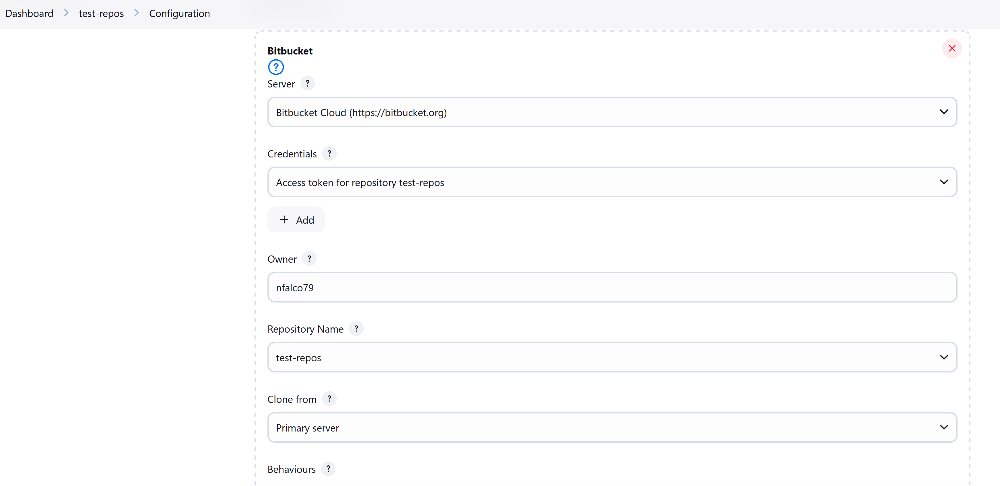

. Finally, save the project. The initial indexing process will run and create projects for branches and pull requests.
+
image::images/screenshot-5.png[]

[id=bitbucket-scm-navigator]
== Organization folders

_Bitbucket Team/Project_ Repository Source can be used in Organization Folder to automatically track branches and pull requests in all Bitbucket Team or Project repositories.

. Create a project of type _Organization Folder_.
+
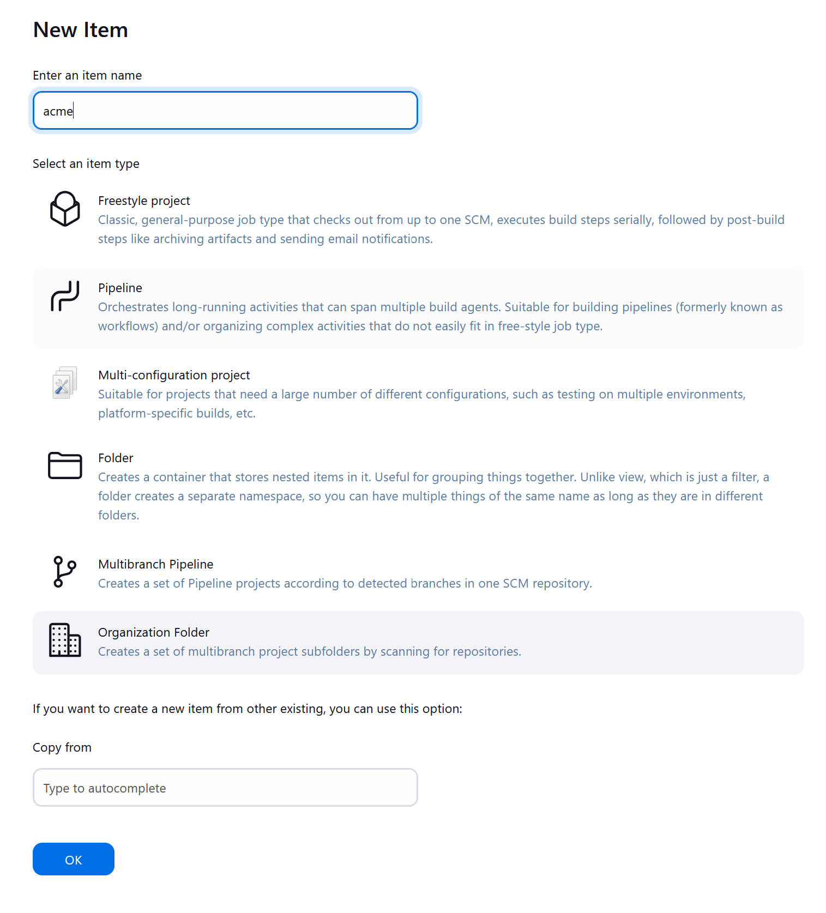

. Add _Bitbucket Team/Project_ as Repository Source
. If you configured more than one _Bitbucket Endpoint_, choose the _Server_ and appropriate _Credential_
. Configure the repository owner. It could be:
.. A Bitbucket Cloud Workspace ID (aka workspace slug): all repositories in the workspace are imported as Multibranch projects.
.. A Bitbucket Data Center Project ID: all repositories in the project are imported as Multibranch projects. *Note that the project ID needs to be used instead of the project name*.
.. A regular username: all repositories which the username is owner of are imported.
+
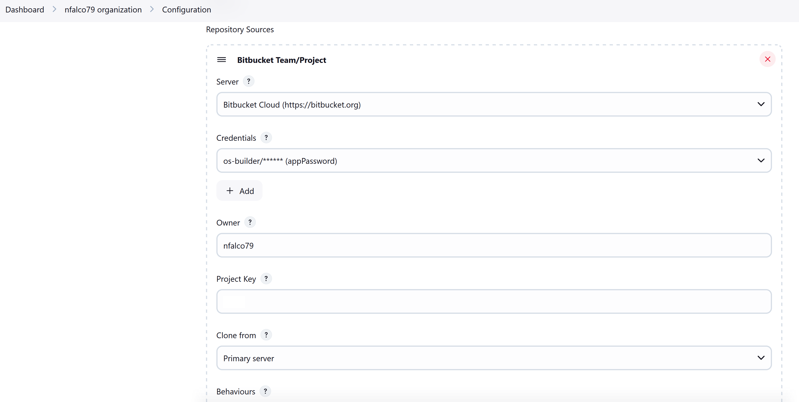

. Save the configuration. The initial indexing process starts. Once it finishes, a Multibranch
project is created for each repository.
+
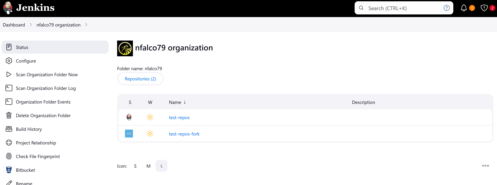

[id=bitbucket-avatar]
== Avatar

This plugin have customized icon designed for the "Organization Folder" image:/src/main/webapp/images/bitbucket-logo.svg[icon,20,20], for "Multibranch Pipeline", for Single Repository image:/src/main/webapp/images/bitbucket-repository-git.svg[icon,20,20] and Folder image:/src/main/webapp/images/bitbucket-scmnavigator.svg[icon,20,20] project type. This is the default behaviour of the plugin starting from version 935.
It is possible associate the Bitbucket avatar to the project item selecting the "Show Bitbucket avatar images" behaviour in the project configuration.

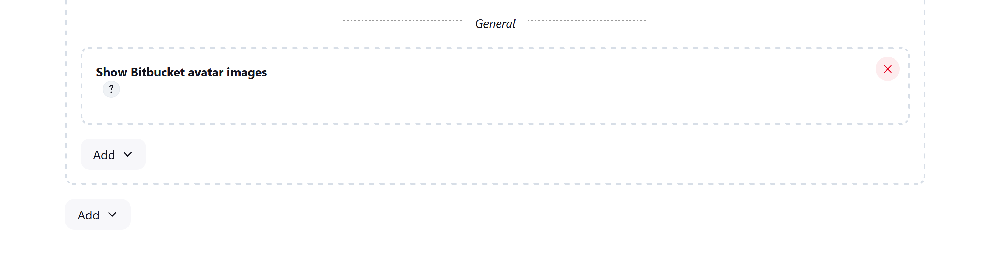

The supported avatars are:

* Organization Folder:
** Cloud: workspace avatar
** Data Center: project avatar
* Multibranch Repository:
** Cloud: repository avatar
** Data Center: does not support customization of the repository avatar

The default Bitbucket avatar is a generated SVG image, since this plugin does not support SVG format, this image will be replaced by a Jenkins random generated image.

[id=bitbucket-webhooks]
== Webhooks registering

The use of link:https://confluence.atlassian.com/bitbucket/manage-webhooks-735643732.html[Bitbucket webhooks]
allows to trigger builds on branches and pull requests just when a new commit is done. Bitbucket plugin exposes a special
service to listen to these webhook requests and acts accordingly by triggering a new reindex and finally
triggering builds on matching branches or pull requests.

Go to "Manage Jenkins" / "System" and locate _Bitbucket Endpoints_. For every endpoint where you want webhooks registered automatically,
check "Manage hooks" and select a "Credential" with enough access to add webhooks to repositories. Since the Credential is used at the system level,
it can be a System scoped credential, which will restrict its usage from Pipelines.
You can setup a custom Jenkins URL to be used as callback URL by the webhooks.

For Bitbucket Data Center only, it is possible chose which webhooks implementation server side to use:

- Native implementation will configure the webhooks provided by default with the Server, so it will always be available.

- Plugin implementation (*deprecated*) relies on the configuration available via specific APIs provided by the link:https://marketplace.atlassian.com/apps/1215474/post-webhooks-for-bitbucket?tab=overview&hosting=datacenter[Post Webhooks for Bitbucket] plugin itself. To get it worked plugin must be already pre-installed on the server instance. This provider allows custom settings managed by the _ignore committers_ trait. _Note: This specific implementation will be moved to an individual repository as soon as link:https://issues.jenkins.io/browse/JENKINS-74913[JENKINS-74913] is implemented._

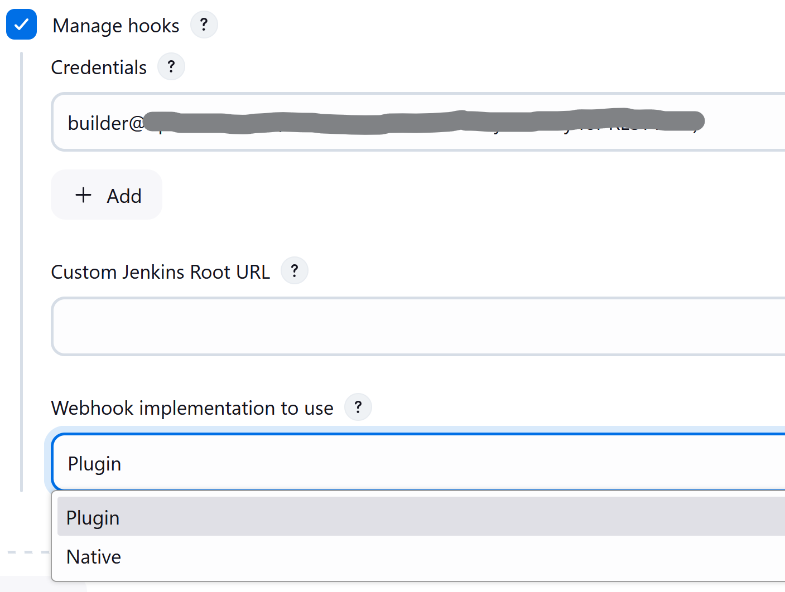

For both Bitbucket _Multibranch Pipelines_ and _Organization folders_ there is an "Override hook management" behaviour
to opt out or adjust system-wide settings.

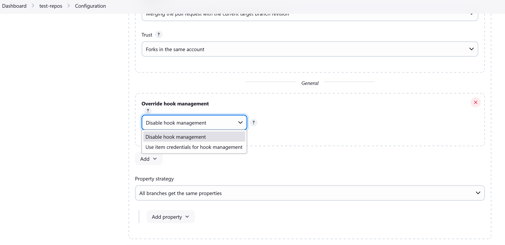

IMPORTANT: In order to have the auto-registering process working fine the Jenkins base URL must be
properly configured in _Manage Jenkins_ » _System_, in alternative the URL must be provided in the endpoint configuration.

=== Signature verification for incoming webhooks

Once Jenkins is configured to receive payloads, it will listen for any delivery that's sent to the endpoint you configured. For security reasons, you should only process deliveries from Bitbucket.
To ensure your self-hosted server only processes deliveries from Bitbucket, you need to:

. Create a secret token for a webhook
. Enable hooks signature verification for the chosen Bitbucket Endpoints
. Select the secret token create at point 1, only _String credentials_ are taken into account.

Any incoming webhook payloads from that given endpoint will be validated against the configured token, to verify they are coming from the configured Bitbucket endpoint URL.

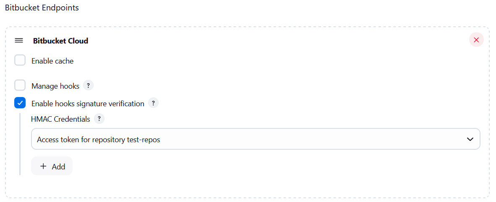

[id=bitbucket-creds-config]
== Credentials configuration

The plugin (for both _Bitbucket multibranch pipelines_ and _Bitbucket Workspace/Project organization folders_) requires a credential to be configured to scan branches. It will also be the default credential to use when checking out sources.

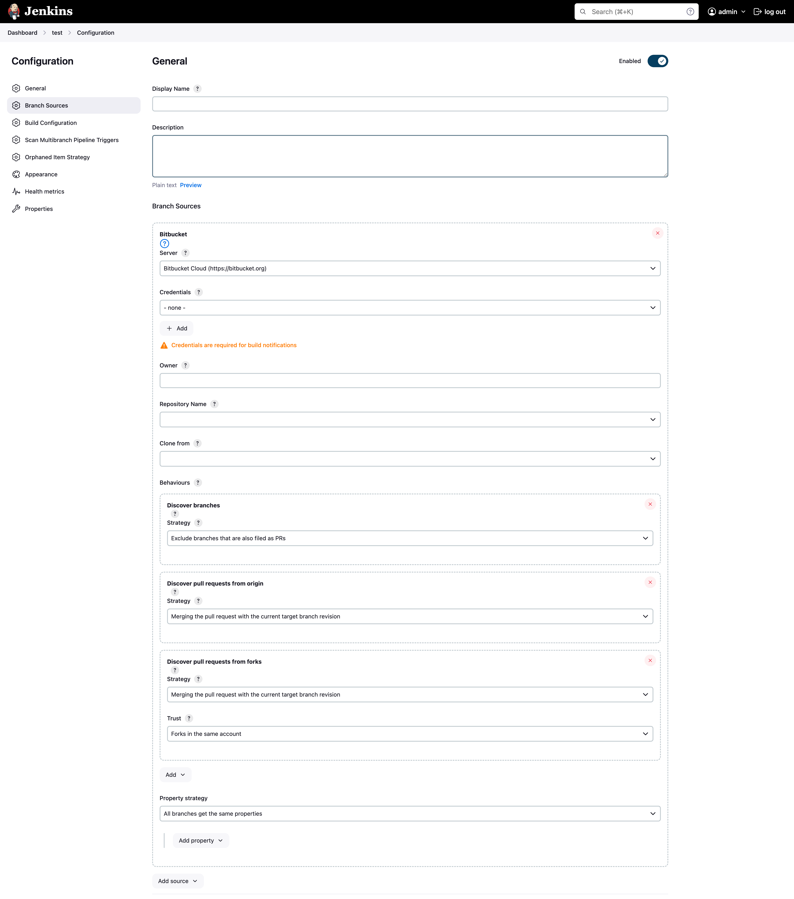

As the `Checkout Credential` configuration was removed in commit (link:https://github.com/jenkinsci/bitbucket-branch-source-plugin/commit/a4c6bf39b83168ff62fc622bd4084ef90cf810c0[a4c6bf3]), you can alternatively add a `Checkout over SSH` behavior in the configuration of Behaviours, so that to configure a separate SSH credential for checking out sources.

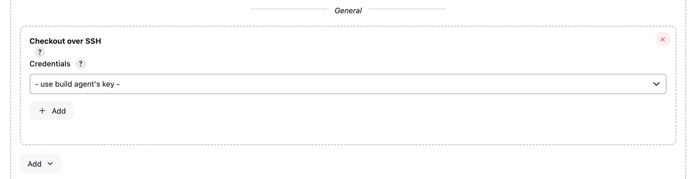

=== Username/Password (Bitbucket Data Center only)

The plugin can use a personal username and password to login (if SSO and MFA in not enabled).

The user must have _admin_ access to the Project if you are configuring an _Organization Folder_ or _admin_ right to the repositories if you are configuring a _Multibrach Project_.

=== Personal Access Token (Bitbucket Data Center only)

The plugin can make use of a personal access token instead of the standard username/password.

First, create a new _personal access token_ in Bitbucket as instructed in the link:https://confluence.atlassian.com/bitbucketserver080/http-access-tokens-1115142284.html[HTTP access tokens | Bitbucket Data Center and Server 8.0 | Atlassian Documentation].
At least allow _read_ access for Projects. If you want the plugin to install the webhooks, allow _admin_ access for repositories.

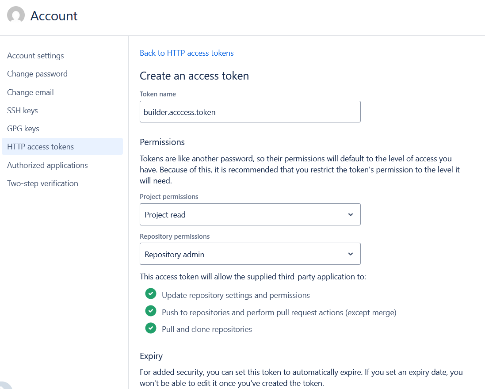

Then create a new _Username with password_ credential in Jenkins, enter the Bitbucket username (not the email) in the _Username_ field and the created access token in the _Password_ field.

=== Access Token (Bitbucket Cloud only)

The plugin can make use of a repository, project or workspace access token.

First, create a new _access token_ in Bitbucket as instructed in one of the following links:

* https://support.atlassian.com/bitbucket-cloud/docs/create-a-repository-access-token/[Repository Access Token | Atlassian Documentation];
* https://support.atlassian.com/bitbucket-cloud/docs/create-a-project-access-token/[Project Access Token | Atlassian Documentation];
* https://support.atlassian.com/bitbucket-cloud/docs/create-a-workspace-access-token/[Workspace Access Token | Atlassian Documentation];

At least allow _read_ access for repositories. If you want the plugin to install the webhooks, allow _Read and write_ access for Webhooks.

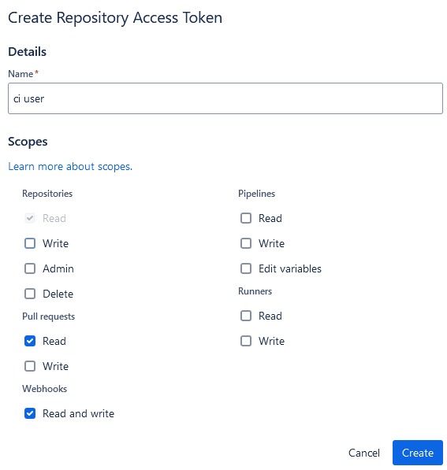

Then create a new _Secret text_ credential in Jenkins, enter the Bitbucket token generated in the previous steps in the _Secret_ field.

If you want be able to perform git push operation from CLI than you have to setup _write_ access for repositories. Than configure the _Custom user name/e-mail address_ trait with the Repository Access Token email generated when you created the Repository Access Token (for example, 52c16467c5f19101ff2061cc@bots.bitbucket.org).

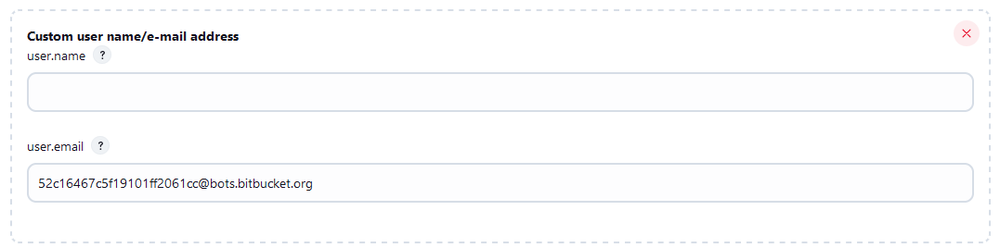

=== App Passwords - DEPRECATED (Bitbucket Cloud only)

Bitbucket https://community.atlassian.com/t5/Bitbucket-articles/Announcement-Bitbucket-Cloud-account-password-usage-for-Git-over/ba-p/1948231[deprecated usage of Atlassian account password] for Bitbucket API and Git over HTTPS starting from March 1st, 2022.

The plugin can make use of an app password instead of the standard username/password.

First, create a new _app password_ in Bitbucket as instructed in the https://support.atlassian.com/bitbucket-cloud/docs/app-passwords/[Bitbucket App Passwords Documentation]. At least allow _read_ access for repositories and pull requests. Also, you may need to allow _read_ and _write_ access for webhooks depending on your pipeline's triggers.

Then create a new _Username with password credentials_ in Jenkins, enter the Bitbucket username (not the email) in the _Username_ field and the created app password in the _Password_ field.

 IMPORTANT: App passwords do not support email address as a username for authentication. Using the email address will raise an authentication error in scanning/checkout process.
 The app passoword authentication has been deprecated by Atlassian and starting from September 9th, 2025 will not longer available for creation. https://www.atlassian.com/blog/bitbucket/bitbucket-cloud-transitions-to-api-tokens-enhancing-security-with-app-password-deprecation[Read here] for more informations.

=== User API Token (Bitbucket Cloud only)

Bitbucket https://www.atlassian.com/blog/bitbucket/bitbucket-cloud-transitions-to-api-tokens-enhancing-security-with-app-password-deprecation[deprecated usage of Atlassian App Password] for Bitbucket API and Git over HTTPS starting from September 9th, 2025.

The plugin can make use of an user API token with scopes instead of the app password.

First, create a new _User API token_ in Bitbucket as instructed in the https://support.atlassian.com/bitbucket-cloud/docs/create-an-api-token/[Bitbucket API Token Documentation]. At least allow _read_ access for project, repositories and pull requests. Also, you may need to allow _read_ and _write_ access for webhooks depending on your pipeline's triggers.

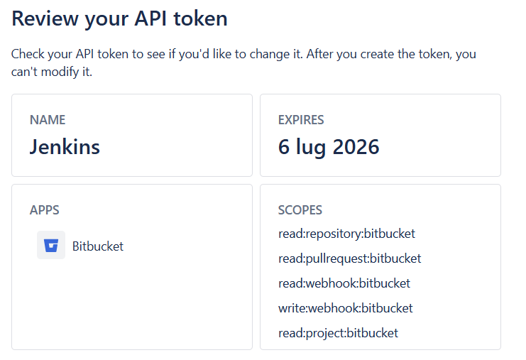

Then create a new _Username with password credentials_ in Jenkins, enter the Atlassian Account email (not the username) in the _Username_ field and the created API token in the _Password_ field.

 IMPORTANT: API token requires the email address as a username to authenticate using the BitbucketAPIs. Using the username will raise an authentication error in scanning/checkout process. API token without scope does not work.

=== OAuth credentials (Bitbucket Cloud only)

The plugin can make use of OAuth credentials instead of the standard username/password.

First create a new _OAuth consumer_ in Bitbucket as instructed in the https://confluence.atlassian.com/bitbucket/oauth-on-bitbucket-cloud-238027431.html[Bitbucket OAuth Documentation].
Don't forget to check _This is a private consumer_ and at least allow _read_ access for repositories and pull requests. If you want the plugin to install the webhooks, also allow _read_ and _write_ access for webhooks.

image::images/screenshot-10.png[]

Then create new _Username with password credentials_ in Jenkins, enter the Bitbucket OAuth consumer key in the _Username_ field and the Bitbucket OAuth consumer secret in the _Password_ field.

image::images/screenshot-11.png[]

image::images/screenshot-12.png[]

[id=bitbucket-mirror-support]
== Mirror support

A mirrored Git repository can be configured for fetching references. This feature is available only on Bitbucke Data Center.

The mirror is not used in the following cases:

- If the source branch in a pull request resides in a different repository, the source branch is fetched from the primary repository while the target branch is fetched from the mirror.

- During initial pull request scanning, the mirror isn't used because of the current design limitations.

Cloning from the mirror can only be used with native web-hooks since plugin web-hooks don't provide a mirror identifier.

For branches and tags, the mirror sync event is used. Thus, at cloning time, the mirror is already synchronised. However, in the case of a pull request event, there is no such guarantee. The plugin optimistically assumes that the mirror is synced and the required commit hashes exist in the mirrored repository at cloning time. If the plugin can't find the required hashes, it falls back to the primary repository.

image::images/screenshot-13.png[]

[id=bitbucket-build-status]
== Bitbucket build status

When a new job build starts, the plugin send notifications to Bitbucket about the build status. An "In progress" notification is sent after complete the git checkout, another notification is sent at the end of the build, the sent value depends by the build result and the configuration given by the trait.

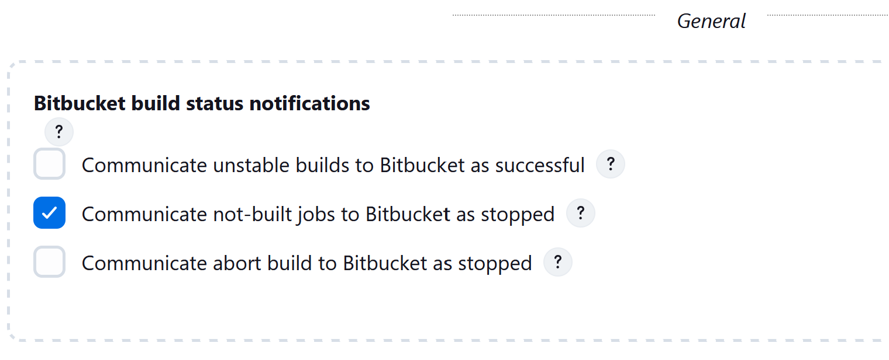

Follow a summary of all possible values:

[cols=3*,options=header]
|===
| Jenkins
| Bitbucket Cloud
| Bitbucket Data Center

| https://javadoc.jenkins.io/hudson/model/Result.html#SUCCESS[SUCCESS]
| SUCCESSFUL
| SUCCESSFUL

| https://javadoc.jenkins.io/hudson/model/Result.html#UNSTABLE[UNSTABLE]
| configurable SUCCESSFUL or FAILED
| configurable SUCCESSFUL or FAILED

| https://javadoc.jenkins.io/hudson/model/Result.html#FAILURE[FAILURE]
| FAILED
| FAILED

| https://javadoc.jenkins.io/hudson/model/Result.html#NOT_BUILT[NOT_BUILT]
| configurable FAILED or STOPPED
| configurable FAILED or CANCELLED

| https://javadoc.jenkins.io/hudson/model/Result.html#ABORTED[ABORTED]
| configurable FAILED or STOPPED
| configurable FAILED or CANCELLED

| null
| INPROGRESS
| INPROGRESS
|===

The STOPPED status prevents merge checks on Cloud, CANCELLED status should prevents merge checks on Data Center

If this does not meet you need you can disable any notification to Bitbucket using the https://github.com/jenkinsci/skip-notifications-trait-plugin/[skip-notifications-trait-plugin] and provide notification about the build status yourself. This can be achieved via a curl shell command or by using build steps provided by the https://github.com/jenkinsci/bitbucket-build-status-notifier-plugin[bitbucket-build-status-notifier-plugin].

[id=bitbucket-env-var]
== Environment Variables

This plugin contribute to the enviroment the following variables:

- BITBUCKET_REPOSITORY: the repository name/slug
- BITBUCKET_OWNER: the repository owner name/slug, in Bitbucket Cloud is the equivalent of workspace name
- BITBUCKET_PROJECT_KEY: the project key in which the repository is contained
- BITBUCKET_SERVER_URL: the Bitbucket endpoint URL

These variables were added to allow users to easily integrate calls to Bitbucket's REST APIs into their own pipelines to implement own business logics.

NOTE: Since variables are contributed through a GitSCMExtension they will be available only after performed the checkout scm step.
For the same reason existing projects must be updated with a "Scan Organization Folder Now" or "Scan Multibranch Project Now" action to persist the new git extension in the job configuration.

[id=bitbucket-misc-config]
== Miscellaneous configuration

=== Client Timeout

In case of slow network, you can increase socket timeout using the link:https://jenkins.io/doc/book/managing/script-console/[Script Console]:

[source,groovy]
----
System.setProperty("http.socket.timeout", "300") // 5 minutes
----

=== Client OAuth2 cache Timeout

In case Bitbucket has been configured to expire OAuth2 tokens before 5 minutes, you can configure via a JVM property the release time of the cache where all obtained OAuth2 tokens are stored. This setting is to avoid requests with expired tokens that will produce HTTP 401 responses. link:https://support.atlassian.com/bitbucket-cloud/docs/use-oauth-on-bitbucket-cloud/[Bitbucket Cloud] access tokens expire in two hours.
To change this amount of time (default is 300 seconds), add the system property `bitbucket.oauth2.cache.timeout=60` on Jenkins startup.

=== Enable Branch Indexing on Empty changes

By default, the plugin does not triggers *a full branch indexing* when a push event contains *empty* changes. This may happen on various scenario, mainly in Bitbucket Data Center, such as:

* When manually merging remote **Open** pull requests. This particular scenario produces 2 events and cause duplicated builds.
* For a fork, when link:https://confluence.atlassian.com/bitbucketserver/keeping-forks-synchronized-776639961.html[Auto-Sync] is on and a branch cannot be synchronised
* A link:http://confluence.atlassian.com/bitbucketserver/event-payload-938025882.html#Eventpayload-Mirrorsynchronized[mirror:repo_synchronized] event with too many refs

This behaviour can be enabled by adding the system property `bitbucket.hooks.processor.scanOnEmptyChanges=true` on Jenkins startup.
